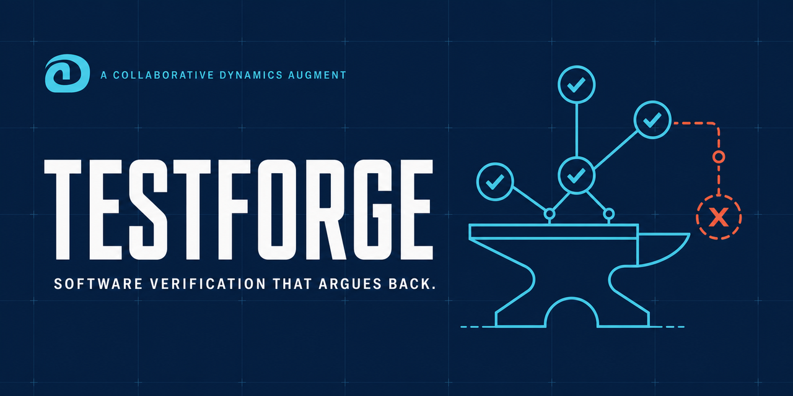

# TestForge

TestForge is a free Collaborative Dynamics Augment that gives inexpensive local coding Agents a verification discipline they do not reliably improvise on their own. It turns software changes, repositories, defects, and release candidates into risk-ranked evidence instead of a comforting pile of green checkmarks.

The bundled Augment testbed generalizes the same discipline beyond code. Every capability you build can carry behavioral evals, run isolated trials, expose the exact failed dimensions, guide reengineering, seal the evidence, promote a reviewed passing baseline, and detect regression later. TestForge makes “I should check this” an operative capability and “it worked before” a durable record.

This is not one-shot benchmarking. **TestForge is a quality ratchet for Agent competence:** failures drive reengineering, reviewed success becomes the new baseline, and regression gates resist backward motion. One way, upwards.

The operating loop is: **build → test → diagnose → reengineer → rerun → review → promote → regression-check**.

## Built with Codex and GPT-5.6 during OpenAI Build Week

TestForge was conceived and built during the July 13-21, 2026 submission period. Stun supplied the product intention, approved capability map, promptcraft system, evaluation philosophy, and release judgment. Codex with GPT-5.6 Sol turned that design into the complete Augment, repaired defects found during execution, packaged it, and then helped use TestForge to build the behavioral testbed included here.

The primary Codex build task completed roughly 35 minutes of active construction. The result is not a prompt folder wearing a fake moustache: it is an installable two-SKILL verification system with deterministic tools, schemas, examples, evals, independent review, host adapters, CI, and an evidence-recording testbed. Its practical wager is simple: externalized method and memory can buy more competent work from cheaper cognition.

Read the [Build Week collaboration and architecture record](BUILD-WEEK.md), or take the [five-minute fictional judge path](JUDGE-QUICKSTART.md).

It includes two Agent SKILLs:

- `$software-verification` reconstructs impact, ranks failure risk, designs meaningful oracles, creates stack-compatible tests, interprets execution evidence and issues a traceable release assessment.
- `$verification-reviewer` independently attacks the evidence chain for catastrophic omissions, weak tests, unsupported claims and verdicts that outrun the proof.

This repository also includes the CD Augment evaluation testbed used to run isolated behavioral cases, keep answer keys away from the evaluated model, record criterion-level judgments, preserve hard gates outside the average and promote reviewed regression baselines.

## What you can do with it

- Give a limited local coding Agent a reusable risk model, oracle discipline, evidence vocabulary, and skeptical second pass.
- Hand an Agent a bug, diff, feature or failing test and get a risk-driven verification plan.
- Generate tests that try to expose consequential failure rather than merely exercise edited lines.
- Distinguish product defects, test defects, environment failures, flaky behavior and insufficient evidence.
- Produce `READY`, `READY_WITH_RESIDUAL_RISK`, `NOT_READY`, `INSUFFICIENT_EVIDENCE` or `BLOCKED_BY_ENVIRONMENT` with a reproducible evidence trail.
- Challenge that conclusion with a separate skeptical reviewer.
- Run and track behavioral evals for other Augments with Codex or local Ollama models.
- Preserve reviewed baselines so future builds can compare behavior instead of relying on remembered impressions.

TestForge is advisory verification machinery. It does not prove defect freedom, certify compliance, grant production access, authorize release, or turn model confidence into evidence.

## Repository map

- [`testforge/`](testforge/) - the complete portable TestForge Augment v1.1.0.
- [`testforge/docs/QUICK-START.md`](testforge/docs/QUICK-START.md) - install and first-use guide.
- [`RELEASE-NOTES-v1.1.0.md`](RELEASE-NOTES-v1.1.0.md) - dual-host release changes and exact untested boundary.
- [`testforge/docs/SALES-DEMO.md`](testforge/docs/SALES-DEMO.md) - a compact proof-of-value scenario.
- [`tools/augment-evals/`](tools/augment-evals/) - isolated Augment behavioral evaluation harness.
- [`tools/augment-evals/README.md`](tools/augment-evals/README.md) - testbed setup, run, review, seal, promote and regression workflow.

## Quick start: install the Codex plugin

```text
codex plugin marketplace add Stunspot/TestForge
codex plugin add testforge@cd-testforge
```

Start a new Codex task, then invoke `$software-verification` or `$verification-reviewer`. The plugin bundles one canonical TestForge v1.1.0 package behind both entry points so their doctrine, tools, examples, and status vocabulary stay aligned. Its marketplace namespace is product-specific, so TestForge can coexist with other Collaborative Dynamics plugin repositories.

## Quick start: use the standalone Agent SKILLs

Download the latest release, unzip it and keep the `testforge/` tree together. Expose both directories under `testforge/skills/` through your Agent host's skill mechanism. Host-specific notes are included for [Codex](testforge/adapters/codex.md), [Claude Code](testforge/adapters/claude-code.md), [GitHub](testforge/adapters/github.md), [local shell](testforge/adapters/local-shell.md) and [copy-paste chat](testforge/adapters/copy-paste-chat.md).

Then start with:

```text
$software-verification Verify this change. Reconstruct what could break, create the smallest credible evidence set, run only safe authorized checks, and give me an evidence-backed release assessment.
```

After the evidence package exists, use a fresh context when practical:

```text
$verification-reviewer Challenge this verification package and tell me whether its release status is actually supported.
```

Python 3.10+ is needed only for deterministic tools. The TestForge package itself has no mandatory third-party Python dependency.

## Quick start: run Augment behavioral evals

From the repository root:

```powershell
py -m pip install -r tools\augment-evals\requirements.txt
py tools\augment-evals\augment_eval.py validate testforge
```

Then choose a supplied adapter or create one using the documented adapter contract. Local Ollama and signed-in Codex CLI examples are included. Raw runs remain local under `evaluation-results/`; reviewed compact baselines can be promoted into Git-tracked records.

## Trust and evidence

The release contains synthetic planted-defect examples, deterministic package tooling, canonical eval cases and reviewed local baselines. Read the exact exercised and unexercised boundaries in [`testforge/docs/LIMITATIONS.md`](testforge/docs/LIMITATIONS.md), [`testforge/SECURITY.md`](testforge/SECURITY.md) and the testbed README.

Do not send secrets or unnecessary proprietary code in an issue. Active security testing, destructive operations, production access, dependency installation, production-code changes, CI changes and external publication remain explicitly authorized human decisions.

## License

TestForge uses a split license: MIT for Python software and machine-readable schemas, and CC BY-ND 4.0 for the authored Augment materials. You may redistribute the authentic, unmodified branded Augment, including inside a larger commercial product. See [`LICENSE.md`](LICENSE.md), [`ATTRIBUTION.md`](ATTRIBUTION.md) and [`TRADEMARKS.md`](TRADEMARKS.md).

## Publisher

TestForge is a Collaborative Dynamics Augment. Issues and contributions are welcome under the boundaries in [`CONTRIBUTING.md`](CONTRIBUTING.md) and [`SECURITY.md`](SECURITY.md).
